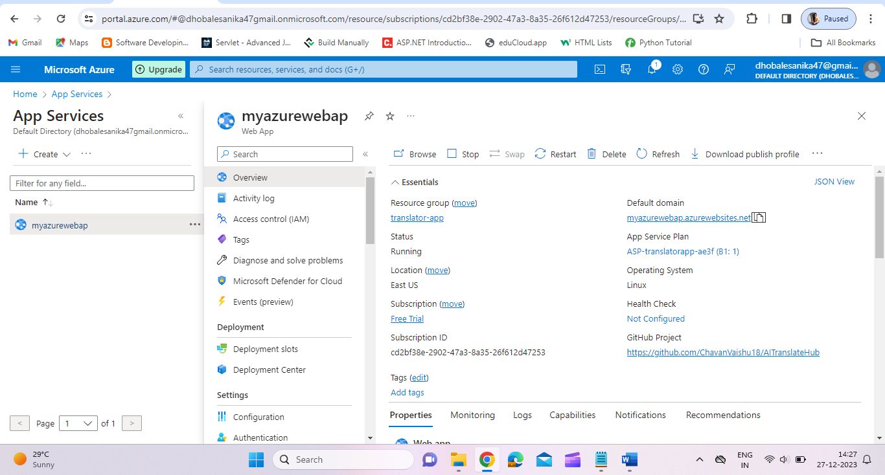
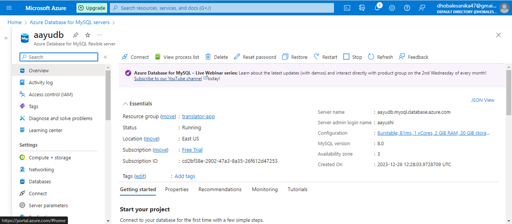
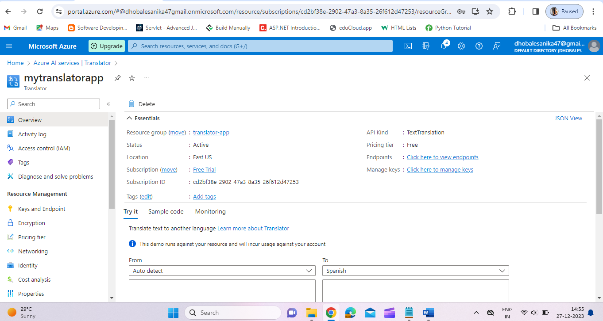
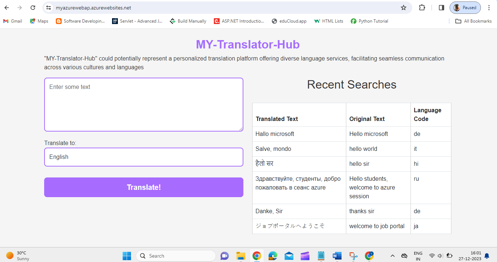

<h1>Microsoft-Future-Ready-Talent-Virtual-Internship-Project</h1>
<h2>Project Title:</h2><b><a href="https://aiwebappazure.azurewebsites.net/">"AITranslatorHub" could potentially represent a personalized translation platform offering diverse language services, facilitating seamless communication across various cultures and languages</b></a>
 
<h2>Project Details</h2>
<b>Project Demo URL :</b> https://myazurewebap.azurewebsites.net/  
<b>Demo Video URL :</b> https://drive.google.com/file/d/1bLptg01EM3NtTRZY6j6X_FCmrwf_2TN9/view  
<b>Github Repository URL :</b> https://github.com/ChavanVaishu18/AITranslateHub.git  
<b>Industry :</b> Lifestyle and Technology 
<h2>Azure Services Used</h2>
<h3>
Core Azure Services :  
1. Azure App Service  
2. Azure SQL Database    
Azure AI Service  
1. Azure AI Translator Service
</h3>
<h2>Problem Statement</h2>

The ability to communicate effectively across linguistic divides has become essential in today's highly interconnected society. Our main objective is to create a user-focused platform that precisely records user interactions and translates material with ease. Our goal is to provide a scalable, effective solution that meets a range of language translation requirements. Furthermore, by using recent search data, we hope to improve user experience and guarantee a more seamless and customized interaction path.

<h2>Project Description</h2>

An easy-to-use web platform called "MY-Translator-Hub" was developed to expedite language translation assignments and maintain an extensive record of user communications. By allowing users to input text, it makes use of the Azure AI Translator service's capabilities to provide accurate and contextually appropriate translations. In addition, the app has a handy function that displays the results of recent searches, making it simple for users to go back and utilize their earlier translations.

"Celebrate Global Connectivity: Our AI Translator Website enables effortless connection internationally by seamlessly bridging languages. Utilizing state-of-the-art artificial intelligence technology, it enables users to overcome language boundaries and embrace a global community."

 
<b>Key Features :</b>
<ul>
    <li>Fluent Language Translations</li>
    <li>Intuitive and User-Centric Interface</li>
    <li>Tracking History and Search Records</li>
    <li>Hosted on Azure App Service</li>
    <li>Efficient Data Management with Azure SQL Database</li>
</ul>
<b>Future Enhancements :</b> 

More than merely a stand-alone project, the "My AI Translator Hub" functions as a springboard for possible future developments. There are plans to integrate other Azure features including Azure Storage for effective management of multimedia information and Azure Key Vault to strengthen security protocols. Furthermore, Azure Monitor and Azure Application Insights' strong analytics and monitoring open the way for ongoing improvement and optimization. These channels guarantee continuous enhancements and an optimal user experience.

<h2>Core Azure Services</h2>
<b>Azure App Service :</b> 
 The foundation for hosting the online application is Azure App Service, which ensures scalability, dependability, and simple deployment. Its strength is in allowing for easy connection with different Azure components, which helps to create a unified application environment. Furthermore, it creates a safe and secure environment, guaranteeing the highest level of security and protection for the system as a whole.

<b>Azure MySQL Dtatabase :</b> 
Utilizing the power of Azure SQL Database, the project manages and stores recent search history. This relational database service, which is well-known for its dependability and effectiveness, maintains data consistency and integrity while facilitating quick and efficient querying. Because of its proficiency with data handling, it is the best option for smoothly monitoring and displaying user activities within the system.

<h2>Azure AI Service</h2>
<b>Azure AI Translator Service :</b>  
The core of the translation functionality is powered by Azure AI Translator service. This service employs advanced natural language processing algorithms to provide accurate and contextually relevant translations across a wide array of languages.

<h2>Other Azure Technologies / Services</h2>

In the Multilingual Content Hub, Azure Monitor and Azure Application Insights collaboratively form a dynamic duo, meticulously overseeing application health and person stories.

<b>Azure Monitor :</b>
<b>Real-time Performance Metrics :</b> Monitors vital overall performance indicators, ensuring the application runs seamlessly. 
<b>Proactive Alerts :</b> Issues immediately alerts on deviations from set overall performance thresholds, enabling fast responses to capability disruptions.

<b>Azure Application Insights :</b>

<b>User Interaction Insights :</b> Analyzes consumer behaviors, providing distinctive facts on trips and characteristic recognition. 
<b>Diagnostics Precision :</b> Traces requests comprehensively, facilitating quick identity and determination of issues at each frontend and backend degrees.

<h2>Screenshots</h2>
<h3>Azure App Service</h3>
<b>Description :</b>
Azure App Service delivers a robust and adaptable hosting infrastructure for the Multilingual Content Hub. This service ensures smooth deployment processes and guarantees high availability, ultimately enhancing the overall user experience to its peak potential.

</img> 

<h3>Azure Databse for MySQL</h3>
<b>Description :</b>
 The project leverages Azure Database for MySQL to efficiently manage and store user interaction history. This relational database service ensures data consistency and supports quick retrieval of information.

</img> 

<h3>Azure AI Translator Service</h3>
<b>Description :</b>
Azure AI Translator Service is the engine behind the Multilingual Content Hub's language translation capabilities. It employs advanced natural language processing to deliver accurate and contextually relevant translations.

</img> 

<h3>Working Live Project Display</h3>
<b>Description :</b>
Here I am attaching the final working website's screenshot for the reference.

</img>

<h2>Final Project Statement</h2>

Language networking is being revolutionized by the innovative combination of technology and linguistic experience found in the My-AI-Translator-AITranslatorHub. With the support of Azure's strong infrastructure, it transcends linguistic borders and imagines a time when communication is limitless.

This chapter's conclusion signifies not just the end of an application but also the beginning of a never-ending adventure exploring countless communication possibilities. This effort is a major step towards a more inclusive and connected world in an era characterized by global interconnection.

</h2><b><a href="https://aiwebappazure.azurewebsites.net/">Certainly! An alternative to "TranscendLingua" could be:

"TranscendLingua: - AITranslatorHub Translation Web App using Azure AI Translation Service"</b></a>
